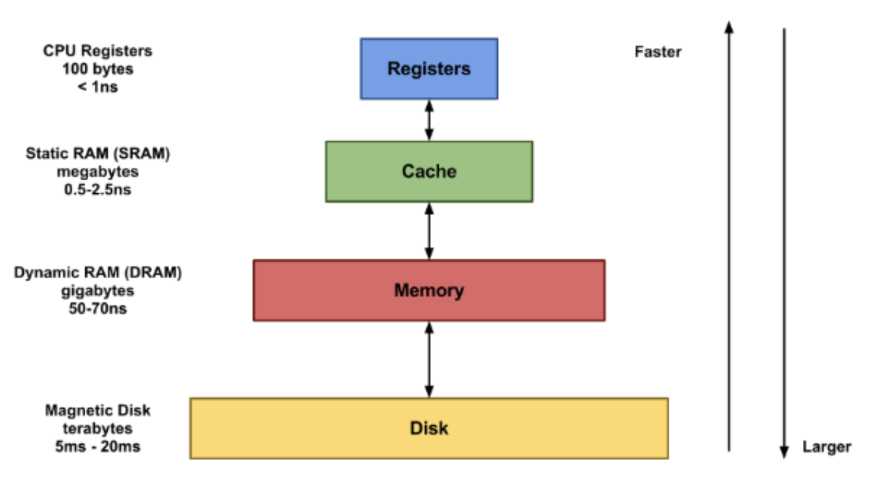

# 레디스

Remote Dictionary Server의 약자로서, “키-값” 구조의 비정형 데이터를 저장하고 관리하기 위한 오픈 소스 기반의 비관계형 데이터베이스 관리 시스템(DBMS)이다.

* "키-값 구조"
* 비관계형 데이터베이스 관리 시스템
* 캐시서버

## 레디스

* redis(Remote Dictionary Server)는 메모리 기반의 키-값 구조 데이터 관리 시스템
* 모든 데이터를 메모리에 저장하고 조회하기에 빠른 read, write 속도를 보장하는 비 관계형 데이터 베ㅐ이스이다.
* 레디스 데이터는 메모리에 상주한다. 
* 메모리 상에서 데이터를 저자한다.
* redis 는 In-Memoery Database
* 다양한 데이터 타입을 지원
* Key-Value 모델의 NoSQL(JSON)
* In-memory database는 기본적으로 데이터 베이스는 hdd, ssd에 저장하는데 main memory에 저장하는 방법을 채택하게 되는 것이다.

## 데이터 타입

* Memcached와 가장 큰 차이는 collection 자료구조를 지원한다.
* Sting, Set, Sorted Set Hash , List 의 크게 5가지 데이터 형식을 지원한다. 

---

## 캐시 서버

### 캐시
* 결과를 미리 저장했다가 빠르게 사용하는 것이다. 

### 캐싱
일반적으로 일시적인 특징이 있는 데이터 하위 집합을 저장하는 고속 데이터 스토리지 계층이다. 데이터의 기본 스토리지 위치에 엑세스할 때 보다 더 빠르게 요청을 처리할 수 있다.

---

# 메모리 계층 구조

메모리 계층 구조에서 상위 계층으로 갈 수록 빠르고 비싼 저장소이다. 

## register

* cpu 안에 존재하는 저장 공간
* 현대 프로세서는 메인 메모리에서 레지스터로 데이터를 옮겨와 처리한 후 다시 메인 메모리로 저장하는 설계 방법을 사용함

## Cache 
* cpu 내부에 존재하는 저장공간
* 명령어를 저장하는 Instruction Cache와 데이터를 저장하는 Data Cache로 구분된다. L1 Cache, L2 Cache 등 여러 레벨으로 분할해서 세부 계층화 하기도 한다.

## RAM 

* CPU와 별개인 메모리 중 최상위 메모리이며 주기억장치의 최하위 메모리이다. 
* SSD, HHD와 Cache의 속도 차이를 메꾸기 위해 만들어진 제품이다.

## SSD

* Solid State Drive이며 전기적으로 동작하는 cpu, graphic card, ram 과 달리 물리적으로 동작하기 때문에 병목 현상이 걸린다. 

~~~
pc의 병목 현상
두 구성 요소의 최대 성능의 차이로 한 구성 요소가 다른 하드웨어의 잠재 성능을 제한한다. 
~~~

## HDD

* 비휘발성 데이터 저장소이다.
* 플래터란 하드 디스크에서 데이터가 저장되는 원판을 말한다.
* 플래터의 헤드가 물리적으로 움직이면서 작동된다.

### SSD vs HDD

#### HDD
* 비휘발성
* 물리적으로 정보를 저장한다.

#### SSD
* 비휘발성
* 전자적으로 정보를 저장한다. 
* 플래시 메모리 형태이다. 플래시 메모리란 전기적으로 데이터를 지우고 다시 기록할 수 있는 비휘발성 컴퓨터 기억 장치를 말한다.

## 현재 쓰이는 메모리 계층 구조

* Disk(hdd/ssd) -> Memory(RAM) -> Cache(L3, L2, L1) -> Register 단계이다.

